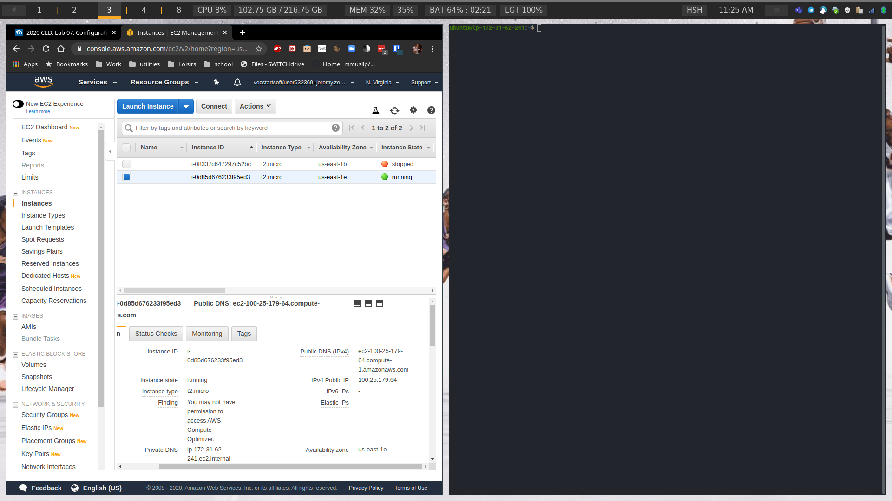

# LAB 07: CONFIGURATION MANAGEMENT - ANSIBLE

## Auteurs : Jeremy Zerbib, Samuel Mettler

## Date : 4 juin 2020

### TASK 1: INSTALL ANSIBLE

L'installation s'est déroulée sans encombre.

Nous avons bien eu la sortie suivante lors de l'exécution de la commande `ansible --version` :

```bash
ansible 2.9.9
  config file = None
  configured module search path = ['/home/jeremyz/.ansible/plugins/modules', '/usr/share/ansible/plugins/modules']
  ansible python module location = /usr/lib/python3.8/site-packages/ansible
  executable location = /usr/bin/ansible
  python version = 3.8.2 (default, Apr  8 2020, 14:31:25) [GCC 9.3.0]
```

### TASK 2: CREATE A VM ON AMAZON WEB SERVICES

Nous avons pu nous connecter sur la *VM* via `SSH` sans aucun problème.

 

### TASK 3: CONFIGURE ANSIBLE TO CONNECT TO THE MANAGED VM

Toutes les sorties sont correctes :


### TASK 4: INSTALL WEB APPLICATION

La tâche s'est déroulée sans peine :


### TASK 5: TEST DESIRED STATE CONFIGURATION PRINCIPLES

1. Return to the output of running the web.yml playbook the first time. There is one additional task that was not in the playbook. Which one? Among the tasks that are in the playbook there is one task that Ansible marked as ok. Which one? Do you have a possible explanation?

   ```bash
   PLAY [Configure webserver with nginx] ******************************************************************************************************************************************************************************************************************************************
   
   TASK [Gathering Facts] *********************************************************************************************************************************************************************************************************************************************************
   ok: [testserver]
   
   TASK [install nginx] ***********************************************************************************************************************************************************************************************************************************************************
   ok: [testserver]
   
   TASK [copy nginx config file] **************************************************************************************************************************************************************************************************************************************************
   ok: [testserver]
   
   TASK [enable configuration] ****************************************************************************************************************************************************************************************************************************************************
   ok: [testserver]
   
   TASK [copy index.html] *********************************************************************************************************************************************************************************************************************************************************
   ok: [testserver]
   
   TASK [restart nginx] ***********************************************************************************************************************************************************************************************************************************************************
   changed: [testserver]
   
   PLAY RECAP *********************************************************************************************************************************************************************************************************************************************************************
   testserver: ok=6 changed=1 unreachable=0 failed=0    skipped=0    rescued=0    ignored=0
   ```

   La tâche qui n'est pas dans le fichier `yml` mais qui apparait en console est la tâche : `Gathering information`. 

2. Re-run the *web.yml* playbook a second time. In principle nothing should have changed. Compare Ansible's output with the first run. Which tasks are marked as changed?

   ```bash
   PLAY [Configure webserver with nginx] ******************************************************************************************************************************************************************************************************************************************
   
   TASK [Gathering Facts] *********************************************************************************************************************************************************************************************************************************************************
   ok: [testserver]
   
   TASK [install nginx] ***********************************************************************************************************************************************************************************************************************************************************
   ok: [testserver]
   
   TASK [copy nginx config file] **************************************************************************************************************************************************************************************************************************************************
   ok: [testserver]
   
   TASK [enable configuration] ****************************************************************************************************************************************************************************************************************************************************
   ok: [testserver]
   
   TASK [copy index.html] *********************************************************************************************************************************************************************************************************************************************************
   ok: [testserver]
   
   TASK [restart nginx] ***********************************************************************************************************************************************************************************************************************************************************
   changed: [testserver]
   
   PLAY RECAP *********************************************************************************************************************************************************************************************************************************************************************
   testserver: ok=6 changed=1 unreachable=0 failed=0    skipped=0    rescued=0    ignored=0
   ```

   La tâche ayant changé est la dernière : `restart nginx`. 

3. SSH into the managed server. Modify the nginx configuration file */etc/nginx/sites-available/default*, for example by adding a line with a comment. Re-run the playbook. What does Ansible do to the file and what does it show in its output?

   A priori, il détecte un changement entre le fichier de configuration sur le serveur et celui en local. C'est pour cela que lors de la copie du fichier de config nginx vers le serveur, nous pouvons noter un changement. 

4. Do something more drastic like completely removing the homepage and repeat the previous question.

   Chez nous, rien n'a été changé. `nginx` a été relancé et donc la page web a été copié vers le serveur. De ce fait, le site a marché normalement.

### TASK 6: ADDING A HANDLER FOR NGINX RESTART

```yaml
- name: Configure webserver with nginx
  hosts: webservers
  become: True
  tasks:
    - name: install nginx
      apt: name=nginx update_cache=yes
    - name: copy nginx config file
      copy: src=files/nginx.conf dest=/etc/nginx/sites-available/default
    - name: enable configuration
      file: >
        dest=/etc/nginx/sites-enabled/default
        src=/etc/nginx/sites-available/default
        state=link
    - name: copy index.html
      template: src=templates/index.html.j2 dest=/usr/share/nginx/html/index.html mode=0644
    - name: restart nginx
      service: name=nginx state=restarted
      notify: "restart nginx"
  handlers:
    - name: restart nginx
      service:
        name: nginx
        state: restarted
      listen: "restart nginx"
```

### TASK 7: ADD MORE MANAGED SERVERS